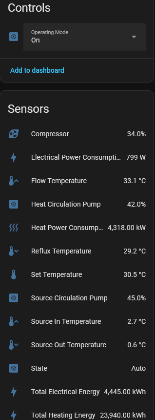
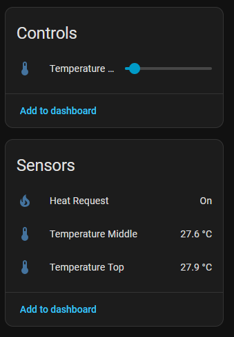
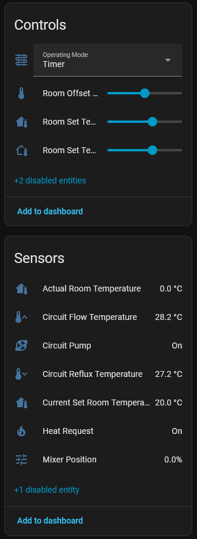
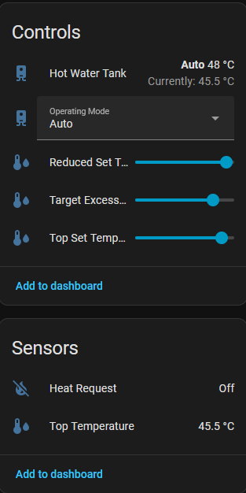
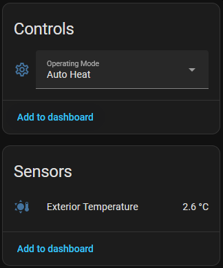

<p align="center">
    
</p>

# KEBA Heat Pump Modbus Integration

[](https://github.com/hacs/integration)
[](http://www.apache.org/licenses/LICENSE-2.0)
[](https://codecov.io/gh/johannesWen/KEBA-Heat-Pump-Modbus-Integration)
[](https://github.com/johannesWen/KEBA-Heat-Pump-Modbus-Integration/actions/workflows/ci.yml)

A custom Home Assistant integration that polls a KEBA heat pump controller over Modbus TCP and exposes operational data as Home Assistant entities. Use it to keep an eye on temperatures, operating states, and circuit health directly from your dashboard.

## What the integration does

- Connects to a KEBA heat pump via Modbus TCP using the host, port, and unit ID you configure.
- Polls defined Modbus registers on a configurable interval to keep data fresh.
- Supports some control entities to change operating modes, temperature, and settings directly from Home Assistant.
- Provides sensors, binary sensors, number and select entities for heat pump components (system, hot water tank, buffer tank, and up to four heating circuits) with manufacturer, model, and device grouping.
- Ships with an options flow so you can adjust the scan interval from the Home Assistant UI after setup.

## Requirements

- Home Assistant with HACS installed.
- Network access from Home Assistant to the KEBA heat pump Modbus interface (default TCP port 502).
- Modbus unit ID for the controller (defaults to `1`).

## HACS Installation

1. Open **HACS** in Home Assistant, click the three dots in the top right corner and select **Custom repositories**.
2. Add 
   
   ```
   https://github.com/johannesWen/KEBA-Heat-Pump-Modbus-Integration
   ``` 
   
   as a repository of type **Integration**.
3. Search for **KEBA Heat Pump Modbus** in HACS and install it.
4. Restart Home Assistant after installation completes.
5. Go to **Settings → Devices & Services → Add Integration** and search for **KEBA Heat Pump Modbus**.
6. Enter the heat pump **Host**, optional **Port** (defaults to `502`), **Unit ID** (defaults to `1`), choose your **Scan interval** and select the number of heating circuits (1-4) your system has.
7. Finish setup. You can revisit the integration options later to change the scan interval without re-adding the device.

## Manual Installation (alternative)

1. Copy the `custom_components/keba_heat_pump_modbus` directory into your Home Assistant `custom_components` folder.
2. Restart Home Assistant.
3. Add the integration via **Settings → Devices & Services → Add Integration** and provide the connection details when prompted.

## Configuration options

- **Host**: IP address or hostname of the KEBA heat pump controller.
- **Port**: Modbus TCP port (defaults to `502`).
- **Unit ID**: Modbus unit/slave ID (defaults to `1`).
- **Scan interval**: How often (in seconds) the integration polls registers; configurable during setup and via options.
- **heat_circuits_used**: Number of heating circuits your system has (1-4).

## Troubleshooting

- Ensure the KEBA controller allows Modbus TCP connections from your Home Assistant host.
- Verify that the configured unit ID and port match the controller settings.
- Increase the scan interval if you experience timeouts or if the controller limits request frequency.

## Homeassistant Devices

<!-- Table 1 -->
<table style="border-collapse: collapse; width: 100%;">
  <thead>
    <tr>
      <th style="text-align: center; vertical-align: top; padding: 8px;">Heat Pump</th>
      <th style="text-align: center; vertical-align: top; padding: 8px;">Buffer Tank</th>
      <th style="text-align: center; vertical-align: top; padding: 8px;">Heat Circuit</th>
    </tr>
  </thead>
  <tbody>
    <tr>
      <td style="text-align: center; vertical-align: top; padding: 8px;">
        
      </td>
      <td style="text-align: center; vertical-align: top; padding: 8px;">
        
      </td>
      <td style="text-align: center; vertical-align: top; padding: 8px;">
        
      </td>
    </tr>
  </tbody>
</table>

<br />

<!-- Table 2 -->
<table style="border-collapse: collapse; width: 100%;">
  <thead>
    <tr>
      <th style="text-align: center; vertical-align: top; padding: 8px;">Hot Water Tank</th>
      <th style="text-align: center; vertical-align: top; padding: 8px;">System</th>
    </tr>
  </thead>
  <tbody>
    <tr>
      <td style="text-align: center; vertical-align: top; padding: 8px;">
        
      </td>
      <td style="text-align: center; vertical-align: top; padding: 8px;">
        
      </td>
    </tr>
  </tbody>
</table>
