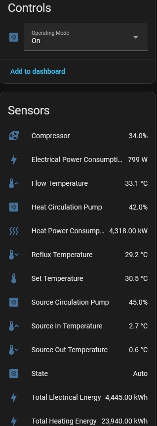
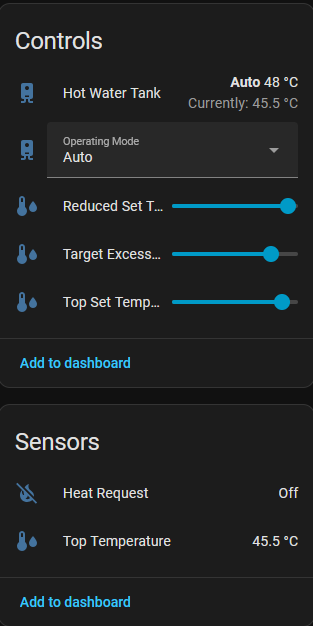
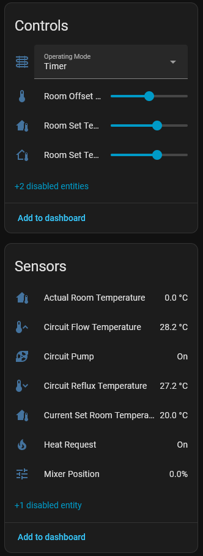
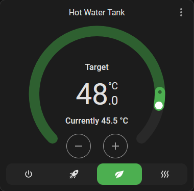
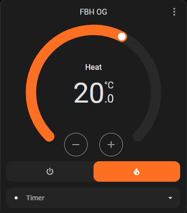
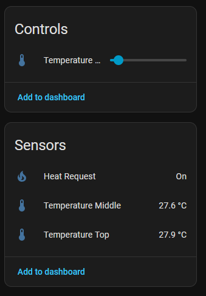
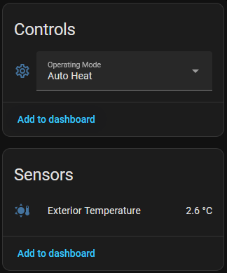

<p align="center">
    
</p>

# KEBA Heat Pump Modbus Integration

[](https://github.com/hacs/integration)
[](http://www.apache.org/licenses/LICENSE-2.0)
[](https://codecov.io/gh/johannesWen/KEBA-Heat-Pump-Modbus-Integration)
[](https://github.com/johannesWen/KEBA-Heat-Pump-Modbus-Integration/actions/workflows/ci.yml)

A custom Home Assistant integration that polls a KEBA heat pump controller over Modbus TCP and exposes operational data as Home Assistant entities. Use it to keep an eye on temperatures, operating states, and circuit health directly from your dashboard.

## What the integration does

- Connects to a KEBA heat pump via Modbus TCP using the host, port, and unit ID you configure.
  - Tested heat pump: [M-Tec](https://www.mtec-systems.com/) WPS412
- Polls defined Modbus registers on a configurable interval to keep data fresh.
- Supports some control entities to change operating modes, temperature, and settings directly from Home Assistant.
- Provides sensors, binary sensors, number and select entities for heat pump components (system, hot water tank, buffer tank, and up to four heating circuits) with manufacturer, model, and device grouping.
- Ships with an options flow so you can adjust the scan interval from the Home Assistant UI after setup.

## Requirements

- Home Assistant with [HACS](https://hacs.xyz/) installed.
- Network access from Home Assistant to the KEBA heat pump Modbus interface (default TCP port 502).
- Modbus unit ID for the controller (defaults to `1`).

## HACS Installation

[](https://my.home-assistant.io/redirect/hacs_repository/?owner=johannesWen&repository=KEBA-Heat-Pump-Modbus-Integration&category=integration)

1. Search for **KEBA Heat Pump Modbus** in HACS and install it.
2. Restart Home Assistant after installation completes.
3. Go to **Settings → Devices & Services → Add Integration** and search for **KEBA Heat Pump Modbus**.
4. Enter the heat pump **Host IP**, optional **Port** (defaults to `502`), **Unit ID** (defaults to `1`), choose your **Scan interval** and select the number of heating circuits (1-4) your system has.
5. Finish setup. You can revisit the integration options later to change the scan interval without re-adding the device.

## Manual Installation (alternative)

1. Copy the `custom_components/keba_heat_pump_modbus` directory into your Home Assistant `custom_components` folder.
2. Restart Home Assistant.
3. Add the integration via **Settings → Devices & Services → Add Integration** and provide the connection details when prompted.

## Configuration options 

- **Host**: IP address or hostname of the KEBA heat pump controller.
- **Port**: Modbus TCP port (defaults to `502`).
- **Unit ID**: Modbus unit/slave ID (defaults to `1`).
- **Scan interval**: How often (in seconds) the integration polls registers; configurable during setup and via options.
- **heat_circuits_used**: Number of heating circuits your system has (1-4).

## Dashboard Card

This integration ships a bundled Lovelace card for quick access to the most common heat pump settings. The card source lives under [`frontend/`](frontend) and is built into `custom_components/keba_heat_pump_modbus/static/` at release time.

Once the integration is set up, the card is **auto-registered** with Home Assistant — no manual Lovelace `resources:` entry is required.

Add the card from the Lovelace UI (**Add Card** → search for **KEBA Heat Pump Modbus**) or configure it directly:

```yaml
type: custom:keba-heat-pump-modbus-card
title: KEBA Heat Pump
entity_prefix: keba_heat_pump_modbus
```

| Option | Type | Default | Description |
| --- | --- | --- | --- |
| `title` | string | `KEBA Heat Pump` | Card title shown in the dashboard. |
| `entity_prefix` | string | `keba_heat_pump_modbus` | Entity id prefix used to resolve integration entities. |
| `view` | string | `settings` | Card view: `settings` or `schedule`. |

The card has two views:

- **Settings** — the default view with system/heat pump/hot water/heating circuit controls.
- **Schedule** — define up to 5 time-based plans that switch the system operating mode automatically.

### Schedule view

Use the Schedule view to create plans that change the heat pump's system operating mode by hour of day. Each plan appears in its own tab; select a tab to edit that plan. The hour grid shows all 24 hours in a compact, responsive layout.

Each plan has:

- **Off mode** — operating mode used outside the selected hours (e.g. `Hot Water`).
- **On mode** — operating mode used during the selected hours (e.g. `Auto Heat`).
- **On hours** — 24 toggle buttons, one per hour.
- **Enabled** — activate or deactivate the plan.

Up to 5 plans can be defined. Multiple plans can be enabled at the same time; plans are evaluated by plan number, with plan 1 having the highest priority. If any enabled plan has the current hour selected, its On mode wins. Otherwise the Off mode of the lowest-numbered enabled plan is used. Changes apply immediately. The scheduler sends a mode command only when the selected mode changes, including changes between Off and On hours. It retries a failed change, but does not resend the same mode for every selected hour. A manual operating-mode change during a scheduled period remains until the next scheduled mode transition. Plans repeat daily using Home Assistant’s configured time zone. The card shows the selected time ranges, saving status, and any service errors.

```yaml
type: custom:keba-heat-pump-modbus-card
title: KEBA Heat Pump Schedule
entity_prefix: keba_heat_pump_modbus
view: schedule
```

> **After updating the integration** (via HACS or manually), **restart Home Assistant** before using new card features. The card is served fresh, but the loaded Python code only changes on restart.

## Development

### Build the bundled card

```bash
cd frontend
npm install
npm run build
```

The build writes `custom_components/keba_heat_pump_modbus/static/keba-heat-pump-modbus-card.js`.

For iterative development with rebuild-on-save:

```bash
npm run watch
```

### Check the schedule card

After building the card, run the Chromium interaction checks from the repository root:

```bash
uv run --with playwright==1.58.0 playwright install chromium
uv run --with playwright==1.58.0 python frontend/tests/check_card.py
```

These checks simulate Home Assistant states and service responses, without connecting to a heat pump. They cover adding and editing plans, failed saves, the plan limit, unavailable entities, and narrow card layouts.

### Local Home Assistant

A Docker Compose stack is provided for testing the integration together with the bundled card against a simulated Modbus TCP server.

```bash
cd frontend && npm install && npm run build && cd ..
docker compose up -d
```

Then open [http://localhost:8123](http://localhost:8123). Add the KEBA integration using the simulator host `modbus-simulator` and port `502` (the simulator is reachable at `localhost:5020` from the Docker host for debugging).

The simulator serves plausible default values for all registers so the integration and card can be exercised without real hardware.

## Troubleshooting

- Ensure the KEBA controller allows Modbus TCP connections from your Home Assistant host.
- Verify that the configured unit ID and port match the controller settings.
- Increase the scan interval if you experience timeouts or if the controller limits request frequency.

## Homeassistant Devices

| Heat Pump | Hot Water Tank | Heat Circuit |
|:---:|:---:|:---:|
|  |  |  |
| |  |  |

| Buffer Tank | System |
|:---:|:---:|
|  |  |
