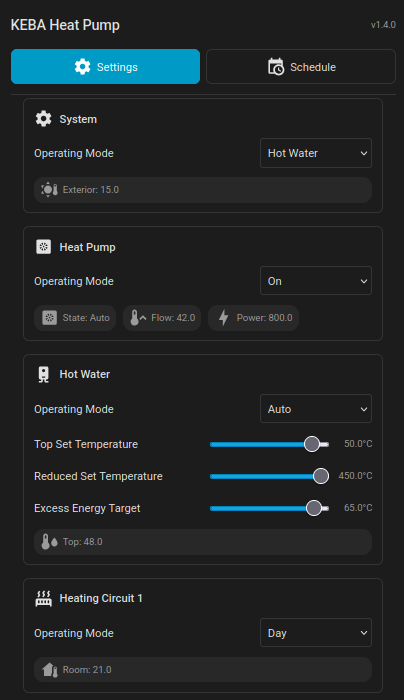
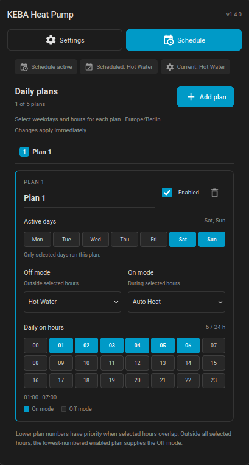
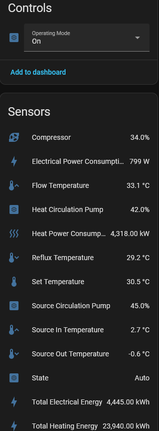
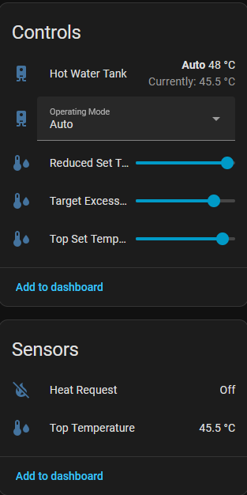
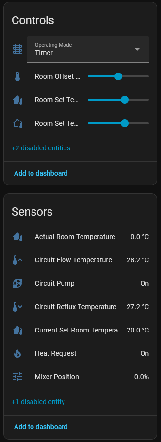
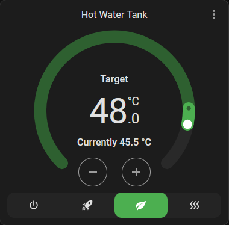
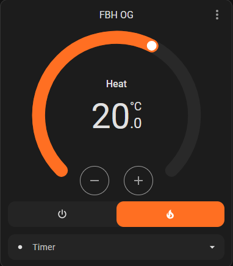
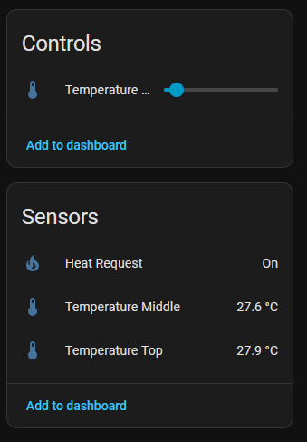
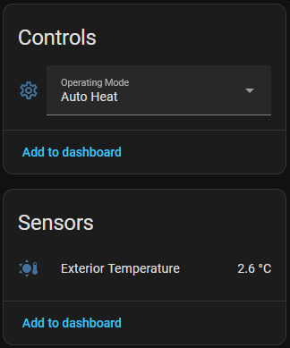

<p align="center">
    
</p>

# KEBA Heat Pump Modbus Integration

[](https://github.com/hacs/integration)
[](http://www.apache.org/licenses/LICENSE-2.0)
[](https://codecov.io/gh/johannesWen/KEBA-Heat-Pump-Modbus-Integration)
[](https://github.com/johannesWen/KEBA-Heat-Pump-Modbus-Integration/actions/workflows/ci.yml)

A custom Home Assistant integration that polls a KEBA heat pump controller over Modbus TCP and exposes operational data as Home Assistant entities. Use it to keep an eye on temperatures, operating states, and circuit health directly from your dashboard.

## What the integration does

- Connects to a KEBA heat pump via Modbus TCP using the host, port, and unit ID you configure.
  - Tested heat pump: [M-Tec](https://www.mtec-systems.com/) WPS412
- Polls defined Modbus registers on a configurable interval to keep data fresh.
- Supports some control entities to change operating modes, temperature, and settings directly from Home Assistant.
- Provides sensors, binary sensors, number and select entities for heat pump components (system, hot water tank, buffer tank, and up to four heating circuits) with manufacturer, model, and device grouping.
- Ships with an options flow so you can adjust the scan interval from the Home Assistant UI after setup.

## Requirements

- Home Assistant with [HACS](https://hacs.xyz/) installed.
- Network access from Home Assistant to the KEBA heat pump Modbus interface (default TCP port 502).
- Modbus unit ID for the controller (defaults to `1`).

## HACS Installation

[](https://my.home-assistant.io/redirect/hacs_repository/?owner=johannesWen&repository=KEBA-Heat-Pump-Modbus-Integration&category=integration)

1. Search for **KEBA Heat Pump Modbus** in HACS and install it.
2. Restart Home Assistant after installation completes.
3. Go to **Settings → Devices & Services → Add Integration** and search for **KEBA Heat Pump Modbus**.
4. Enter the heat pump **Host IP**, optional **Port** (defaults to `502`), **Unit ID** (defaults to `1`), choose your **Scan interval** and select the number of heating circuits (1-4) your system has.
5. Finish setup. You can revisit the integration options later to change the scan interval without re-adding the device.

## Manual Installation (alternative)

1. Copy the `custom_components/keba_heat_pump_modbus` directory into your Home Assistant `custom_components` folder.
2. Restart Home Assistant.
3. Add the integration via **Settings → Devices & Services → Add Integration** and provide the connection details when prompted.

## Configuration options 

- **Host**: IP address or hostname of the KEBA heat pump controller.
- **Port**: Modbus TCP port (defaults to `502`).
- **Unit ID**: Modbus unit/slave ID (defaults to `1`).
- **Scan interval**: How often (in seconds) the integration polls registers; configurable during setup and via options.
- **heat_circuits_used**: Number of heating circuits your system has (1-4).

## Lovelace

This integration ships Lovelace cards for heat pump settings, schedules, and temperature history. Their source lives under [`frontend/`](frontend) and is built into `custom_components/keba_heat_pump_modbus/static/` at release time.

Once the integration is set up, the card is **auto-registered** with Home Assistant — no manual Lovelace `resources:` entry is required.

Add the card from the Lovelace UI (**Add Card** → search for **KEBA Heat Pump Modbus**) or configure it directly:

```yaml
type: custom:keba-heat-pump-modbus-card
title: KEBA Heat Pump
```

| Option | Type | Default | Description |
| --- | --- | --- | --- |
| `title` | string | `KEBA Heat Pump` | Card title shown in the dashboard. |
| `view` | string | `settings` | Card view: `settings` or `schedule`. |

The integration defines the entity prefix internally. The card automatically finds integration entities, including renamed entities; no prefix setting is needed.

The card has two views:

- **Settings** — the default view with system/heat pump/hot water/heating circuit controls.
- **Schedule** — define up to 5 time-based plans that switch heating and hot-water operating modes automatically.

| Settings view | Schedule view |
|:---:|:---:|
|  |  |

### Schedule view

Use the Schedule view to create plans that change heating and hot-water operating modes by hour of day. Each plan appears in its own tab; select a tab to edit it. The hour grid shows all 24 hours in a compact, responsive layout.

Each plan has:

- **Active days** — select Mon–Sun; an empty selection runs every day. A plan is ignored on other days, including its Off modes.
- **Heating Off / On mode** — system operating modes outside and during heating hours (defaults: `Hot Water` / `Auto Heat`).
- **Schedule hot water** — enable independent control of the hot-water device’s Operating Mode. New plans enable it; existing plans remain heating-only until you enable it. Disabling it retains saved hot-water hours; other eligible plans may still control hot water. With none eligible, its current mode is left unchanged.
- **Hot-water Off / On mode** — choose from `Off`, `Auto`, `On`, or `Heat Up` (defaults: `Off` / `On`).
- **Daily hours** — successive clicks cycle from all off to heating only (blue), hot water only (red), both (half blue / half red), then all off (neutral). “All off” applies the configured Off modes. With hot-water scheduling disabled, clicks toggle heating only.
- **Enabled** — activate or pause the whole plan.

Up to 5 plans can be defined. Heating and hot water resolve priority independently: the lowest-numbered enabled plan eligible today with that function selected supplies its On mode. Otherwise the lowest-numbered eligible plan controlling that function supplies its Off mode. If none applies, that device’s mode is left unchanged. A Monday-only plan does not carry past midnight into Tuesday.

Changes apply immediately. Each hour click saves both selections together. The scheduler sends commands only when the selected mode changes, retries failures independently, and does not resend the same mode every hour. Manual mode changes remain until the next scheduled mode transition. Plans use Home Assistant’s configured time zone. The card shows separate time ranges and scheduled/current modes for heating and hot water, saving status, and service errors.

For automations, `set_schedule_hour` retains its heating `on` boolean and accepts an optional `hot_water_on` boolean; omitting it preserves the hot-water selection. The services `set_schedule_hot_water_enabled`, `set_schedule_hot_water_off_mode`, and `set_schedule_hot_water_on_mode` use the same schedules `entity_id` and `plan_id`, with `enabled`, `off_mode`, and `on_mode` respectively. The Scheduled Mode sensor retains its heating state and exposes the hot-water target as the `hot_water_mode` attribute.

```yaml
type: custom:keba-heat-pump-modbus-card
title: KEBA Heat Pump Schedule
view: schedule
```

> **After updating the integration** (via HACS or manually), **restart Home Assistant** before using new card features. The card is served fresh, but the loaded Python code only changes on restart.

### Historical Status card

Add **KEBA Heat Pump Status** from the dashboard card picker to plot temperatures for a selected device. The device selector includes the heat pump, system, hot-water tank, buffer tank, and configured heating circuits that have enabled temperature entities. Measured temperatures and absolute setpoints are included; temperature offsets are excluded. Renamed entities and customized device names are supported, and separate installations stay separate.

Heat-pump temperatures use separate plots for **flow, reflux, and setpoint** and **source in and out**. Heating circuits use one plot for **flow and reflux** and a second for their other temperatures. Buffer tanks show **middle and top** by default; enable other recorded temperatures with the **Additional temperatures** checkboxes. These selections persist for the card session, including time-window changes and refreshes.

```yaml
type: custom:keba-heat-pump-modbus-status-card
title: KEBA Temperature History
time_window: today
```

| Option | Type | Default | Description |
| --- | --- | --- | --- |
| `title` | string | `KEBA Heat Pump Status` | Card title. |
| `device_id` | string | Automatic | Initial Home Assistant registry device; choose it in the visual editor. Automatic selects the first available heat pump. |
| `time_window` | string | `today` | Initial preset: `last_hour`, `last_3_hours`, `last_6_hours`, `today`, `yesterday`, `this_week`, or `this_month`. |

The default **Today so far** runs from midnight to now. **Yesterday** covers the previous complete calendar day, **This week** starts Monday, and **This month** starts on the first day. Calendar boundaries use Home Assistant's configured time zone, including daylight-saving changes. Device and preset changes on the dashboard apply to that card session; the visual editor sets saved defaults. Open-ended windows refresh every minute, and **Refresh** reloads devices and history immediately.

Home Assistant History must be enabled and the entities must be recorded. For week/month windows, older temperature sensor readings use hourly averages where long-term statistics are available. Detailed recorded history takes precedence over overlapping statistics. Number setpoints show retained recorded history; disabled entities, excluded recordings, and purged setpoints cannot be reconstructed. The card reports when it uses hourly averages or cannot retrieve older statistics. It does not change recorder settings or enable entities.

## Development

### Build the bundled card

```bash
cd frontend
npm install
npm run build
```

The build writes `custom_components/keba_heat_pump_modbus/static/keba-heat-pump-modbus-card.js`.

For iterative development with rebuild-on-save:

```bash
npm run watch
```

### Check the cards

After building the card, run the Chromium interaction checks from the repository root:

```bash
uv run --with playwright==1.58.0 playwright install chromium
uv run --with playwright==1.58.0 python frontend/tests/check_card.py
uv run --with playwright==1.58.0 python frontend/tests/check_status_card.py
```

These checks simulate Home Assistant states and service responses, without connecting to a heat pump. They cover adding and editing plans, the four-state hour cycle, hot-water controls, legacy plans, failed saves, the plan limit, unavailable entities, and narrow card layouts.

Status checks cover device discovery, renamed entities, setpoints, multiple installations, time zones and daylight-saving boundaries, statistics fallback, errors and retries, stale responses, lifecycle cleanup, the editor, and narrow layouts. To check the real chart renderer, use the development Home Assistant stack below; its dashboard includes the Status card.

### Local Home Assistant

Reopen this repository in the VS Code dev container. It starts Home Assistant and
the Modbus simulator, installs the development dependencies, builds both bundled
Lovelace cards, completes HA onboarding, and configures the KEBA integration with
all four simulated heating circuits automatically.

Open [the development dashboard](http://localhost:8123/lovelace/keba) and log in
with username **dev** and password **dev**. The dashboard includes the control
card, the temperature history card, heat pump status, and hot water controls.
The first startup can take a few minutes while dependencies are installed.

HA accounts, integration entries, and history persist in the Compose `ha-config`
volume across restarts and rebuilds. Initialization runs on every dev container
start and reuses the existing account and integration. To choose other local
development credentials, set `HA_DEV_USERNAME` and `HA_DEV_PASSWORD` before
creating the container; keep using those values for the existing volume.

You can also run the same setup outside the dev container:

```bash
npm --prefix frontend ci
npm --prefix frontend run build
docker compose up -d --build
python3 dev/bootstrap.py
```

HA connects to `modbus-simulator:502`; the simulator is also reachable at
`localhost:5020` from the Docker host for debugging. The simulator serves
plausible default values for all registers so the integration and cards can be
exercised without real hardware. If the host ports are occupied, set
`HA_HOST_PORT` and `MODBUS_HOST_PORT`; pass the corresponding HA URL to
`python3 dev/bootstrap.py --url http://localhost:<HA_HOST_PORT>`.

## Troubleshooting

- Ensure the KEBA controller allows Modbus TCP connections from your Home Assistant host.
- Verify that the configured unit ID and port match the controller settings.
- Increase the scan interval if you experience timeouts or if the controller limits request frequency.

## Homeassistant Devices

| Heat Pump | Hot Water Tank | Heat Circuit |
|:---:|:---:|:---:|
|  |  |  |
| |  |  |

| Buffer Tank | System |
|:---:|:---:|
|  |  |
